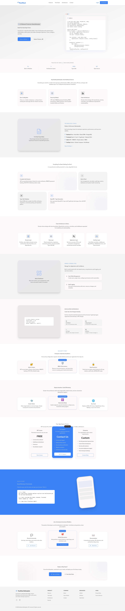
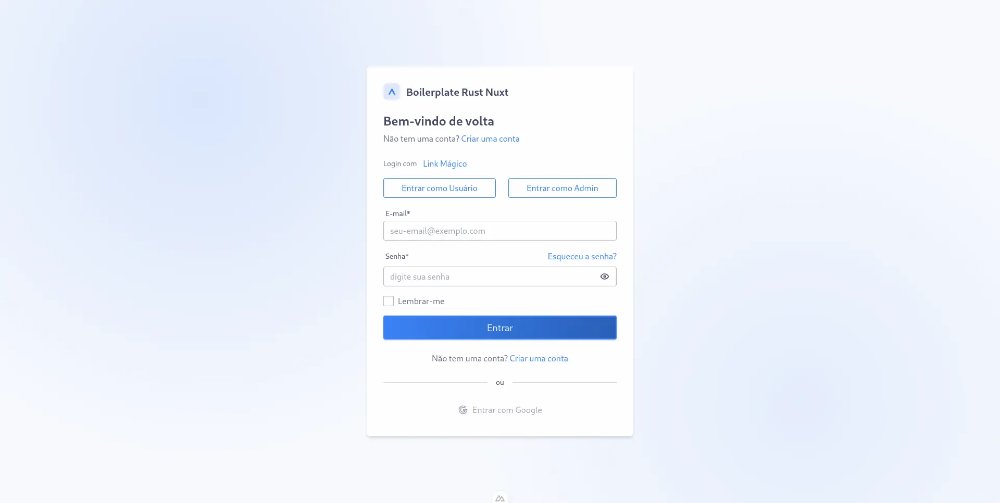
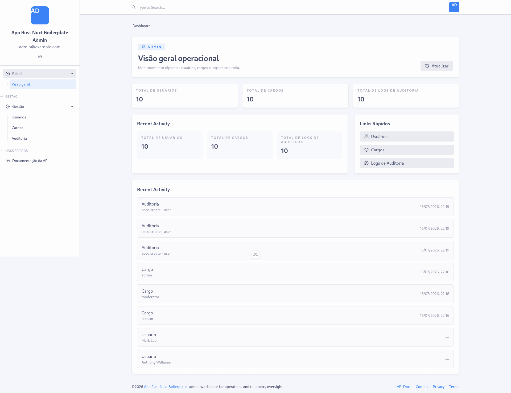

# Rust + Nuxt Boilerplate

> **Production-ready full-stack boilerplate** - Rust (Actix Web) + Nuxt 4 with authentication, RBAC, admin panel, type-safe database layer, and modern developer experience.

[](https://www.rust-lang.org/)
[](https://actix.rs/)
[](https://nuxt.com/)
[](https://tailwindcss.com/)
[](https://www.postgresql.org/)
[](https://www.docker.com/)
[](LICENSE)

---

## 📑 Table of Contents

- [Features](#-features)
- [Quick Start](#-quick-start)
- [API Routes](#-api-routes)
  - [Authentication](#authentication)
  - [Admin](#admin)
  - [Health & Metrics](#health--metrics)
  - [Upload](#upload)
  - [WebSocket](#websocket)
  - [Webhooks](#webhooks)
- [Frontend Routes](#-frontend-routes)
  - [Public Pages](#public-pages)
  - [Authentication Pages](#authentication-pages)
  - [User Portal](#user-portal)
  - [Admin Panel](#admin-panel)
- [Environment Variables](#-environment-variables)
- [Project Structure](#-project-structure)
- [Testing](#-testing)
- [Security](#-security)
- [Deployment](#-deployment)
- [Contributing](#-contributing)

---







---
## ✨ Features

### Backend (Rust / Actix Web)
- **Authentication**: JWT access/refresh tokens, Paseto for email verification, PBKDF2 password hashing, TOTP 2FA, OAuth2 ready
- **Authorization**: RBAC with resource-level permissions, role hierarchies, grant-based authorization (actix-web-grants)
- **Database**: Diesel ORM with compile-time SQL verification, migrations, connection pooling, repository pattern
- **API Docs**: OpenAPI 3.1 (utoipa) → TypeScript client generation, Swagger UI + Scalar
- **Security**: Field-level encryption, blind indexes for PII, key rotation, CSRF protection, rate limiting
- **Observability**: Structured JSON logging (tracing), Prometheus metrics, Grafana dashboards, request tracing
- **Email**: Resend integration, template system, queue-based sending
- **Real-time**: WebSocket server with Redis pub/sub

### Frontend (Nuxt 4 / Vue 3)
- **Type-safe API**: Auto-generated TypeScript client from OpenAPI spec
- **Forms**: vee-validate + valibot, i18n-ready validation
- **UI**: FlyonUI + Tailwind CSS 4, Material Design 3 tokens, dark mode
- **Admin Panel**: User management, role editor, audit logs, metrics dashboard
- **User Portal**: Dashboard, support tickets, profile management
- **Auth Pages**: Login, register, email confirmation, password reset, 2FA setup
- **Internationalization**: @nuxtjs/i18n (pt-BR, en, es)

### DevOps & Infrastructure
- **Multi-stage Docker**: Optimized dev/prod images for both services
- **Docker Compose**: Full stack with hot-reload (dev) and production profiles
- **Nginx**: Reverse proxy with TLS termination, security headers
- **Monitoring**: Prometheus + Grafana (pre-configured dashboards)
- **Search**: MeiliSearch for full-text search
- **Container Mgmt**: Portainer UI
- **CI/CD Ready**: GitHub Actions compatible, health checks, graceful shutdown

---

## 🚀 Local Setup (Recommended)

### Prerequisites
- 4GB+ RAM available
- Ports free: 3000, 8080, 5432, 6379

### 1. Install Rust

```bash
# Linux / macOS
curl --proto '=https' --tlsv1.2 -sSf https://sh.rustup.rs | sh
source "$HOME/.cargo/env"

# Verify
rustc --version
cargo --version
```

[Official docs](https://www.rust-lang.org/tools/install)

### 2. Install Node.js + pnpm

```bash
# Linux / macOS (via nvm)
curl -o- https://raw.githubusercontent.com/nvm-sh/nvm/v0.40.0/install.sh | bash
nvm install 20
nvm use 20

# Verify
node --version   # v20+

# Install pnpm via corepack
corepack enable
corepack prepare pnpm@9 --activate

# Verify
pnpm --version   # 9+
```

[Node.js](https://nodejs.org/) | [nvm](https://github.com/nvm-sh/nvm)

### 3. Install PostgreSQL

```bash
# Ubuntu / Debian
sudo apt update
sudo apt install postgresql postgresql-contrib
sudo systemctl start postgresql
sudo systemctl enable postgresql

# macOS (Homebrew)
brew install postgresql@16
brew services start postgresql@16

# Create database and user
sudo -u postgres createdb boilerplate_dev
sudo -u postgres psql -c "CREATE USER boilerplate WITH PASSWORD 'changeme';"
sudo -u postgres psql -c "GRANT ALL PRIVILEGES ON DATABASE boilerplate_dev TO boilerplate;"

# Verify
psql -U boilerplate -d boilerplate_dev -c "SELECT version();"
```

[PostgreSQL Downloads](https://www.postgresql.org/download/)

### 4. Install Redis

```bash
# Ubuntu / Debian
sudo apt update
sudo apt install redis-server
sudo systemctl start redis-server
sudo systemctl enable redis-server

# macOS (Homebrew)
brew install redis
brew services start redis

# Verify
redis-cli ping   # PONG
```

[Redis Downloads](https://redis.io/download)

### 5. Install Diesel CLI

```bash
cargo install diesel_cli --no-default-features --features postgres

# Verify
diesel --version
```

### 6. Install Extra Tools

```bash
# Hot-reload for backend
cargo install cargo-watch

# Verify
cargo watch --version
```

### 7. Install Proctor (Optional)

[Proctor](https://github.com/alecthomas/proctor) manages multiple processes with health checks and dependency ordering. Written in Rust.

```bash
curl -fsSL https://raw.githubusercontent.com/alecthomas/proctor/master/install.sh | sh

# Verify
proctor --version
```

Proctor starts these services:
- **Backend**: `cargo watch -x "run --bin backend"` → http://localhost:8080
- **Frontend**: `pnpm dev -p 4000` → http://localhost:4000

The frontend runs on port 4000 (instead of 3000) to avoid conflicts with other services.

### 8. Configure the Project

```bash
git clone https://github.com/gilcierweb/rust-nuxt-boilerplate.git
cd rust-nuxt-boilerplate

# Generate secure secrets
./scripts/generate-secrets.sh

# Review generated .env file
cat .env
```

### 9. Run Migrations

```bash
cd backend

# Run migrations
diesel migration run

# Seed demo data (admin user, roles, permissions)
cargo run --bin seed
```

### 10. Start Backend

**Option A: With Proctor (all services at once)**

```bash
cd rust-nuxt-boilerplate
proctor
```

- Backend: http://localhost:8080
- Frontend: http://localhost:4000

**Option B: Manual start**

```bash
cd backend

# With hot-reload (recommended)
cargo watch -x "run --bin backend"

# Or without hot-reload
cargo run --bin backend
```

**Backend:** http://localhost:8080

### 11. Start Frontend

```bash
cd frontend

# Install dependencies
pnpm install

# Start dev server
pnpm dev
```

**Frontend:** http://localhost:3000

### 12. Access Services

| Service | URL | Credentials |
|---------|-----|-------------|
| **Frontend** | http://localhost:3000 | - |
| **Backend API** | http://localhost:8080 | - |
| **Swagger UI** | http://localhost:8080/swagger-ui | - |
| **Scalar** | http://localhost:8080/scalar | - |
| **Health Check** | http://localhost:8080/health | - |
| **Grafana** | http://localhost:3001 | admin / (from .env) |
| **Prometheus** | http://localhost:9090 | - |
| **MeiliSearch** | http://localhost:7700 | master key from .env |
| **Portainer** | http://localhost:9000 | - |

**Default Admin** (after seeding):
- Email: `admin@example.com`
- Password: `changeme123` ⚠️ **Change immediately!**

---

## 🛣️ API Routes

Complete API endpoint reference with authentication requirements and descriptions.

### Authentication

| Method | Endpoint | Auth | Description |
|--------|----------|------|-------------|
| POST | `/api/v1/auth/register` | No | Register new user with email and password |
| POST | `/api/v1/auth/login` | No | Login with email/password, returns JWT + refresh cookie |
| POST | `/api/v1/auth/refresh` | No | Refresh access token using refresh cookie |
| POST | `/api/v1/auth/logout` | Yes | Invalidate refresh tokens and blacklist access token |
| GET | `/api/v1/auth/confirm?token=xxx` | No | Verify email address with confirmation token |
| POST | `/api/v1/auth/recover` | No | Request password reset email |
| POST | `/api/v1/auth/reset` | No | Reset password with reset token |
| GET | `/api/v1/auth/session` | Yes | Get current session user info + new access token |
| GET | `/api/v1/auth/session/` | Yes | Get current session (trailing slash variant) |
| GET | `/api/v1/auth/me` | Yes | Get current authenticated user details |
| POST | `/api/v1/auth/2fa/setup` | Yes | Initialize TOTP 2FA setup, returns QR code URL |
| POST | `/api/v1/auth/2fa/enable` | Yes | Enable TOTP 2FA with verification code |
| POST | `/api/v1/auth/2fa/disable` | Yes | Disable TOTP 2FA with verification code |
| POST | `/api/v1/auth/change-password` | Yes | Change password (requires current password) |

### Admin

All admin endpoints require JWT authentication and appropriate RBAC permissions.

| Method | Endpoint | Auth | Permission | Description |
|--------|----------|------|------------|-------------|
| GET | `/api/v1/admin/users` | Yes | `users:read` | List all users (paginated) |
| GET | `/api/v1/admin/roles` | Yes | `roles:read` | List all roles (paginated) |
| GET | `/api/v1/admin/roles/{id}` | Yes | `roles:read` | Get role by ID |
| POST | `/api/v1/admin/roles` | Yes | `roles:create` | Create new role |
| PATCH | `/api/v1/admin/roles/{id}` | Yes | `roles:update` | Update role by ID |
| DELETE | `/api/v1/admin/roles/{id}` | Yes | `roles:delete` | Delete role by ID |
| GET | `/api/v1/admin/audit-logs` | Yes | `audit_logs:read` | List audit logs (paginated) |
| GET | `/api/v1/admin/audit-logs/{id}` | Yes | `audit_logs:read` | Get audit log by ID |
| POST | `/api/v1/admin/audit-logs` | Yes | `audit_logs:create` | Create audit log entry |
| POST | `/api/v1/admin/upload` | Yes | - | Upload file (multipart form-data) |

### Health & Metrics

| Method | Endpoint | Auth | Description |
|--------|----------|------|-------------|
| GET | `/health` | No | Service health check with DB + Redis probe |
| GET | `/metrics` | No | Prometheus-compatible metrics endpoint |

### Upload

| Method | Endpoint | Auth | Description |
|--------|----------|------|-------------|
| POST | `/api/v1/admin/upload` | Yes | Upload file via multipart form-data. Validates magic bytes, enforces size limits per category (photo/video/audio/document) |

### WebSocket

| Method | Endpoint | Auth | Description |
|--------|----------|------|-------------|
| GET | `/api/v1/ws` | No | WebSocket handler with Redis pub/sub for real-time communication |

### Webhooks

| Method | Endpoint | Auth | Description |
|--------|----------|------|-------------|
| POST | `/api/v1/webhooks/stripe` | Stripe Signature | Handle Stripe webhook events (checkout.session.completed, invoice.paid, invoice.payment_failed, customer.subscription.updated, customer.subscription.deleted) |
| POST | `/api/v1/webhooks/pix` | Provider-specific | Handle Pix webhook events (Brazilian instant payment system) |

### API Documentation

Interactive API documentation is available at:

- **Swagger UI**: http://localhost:8080/swagger-ui
- **Scalar**: http://localhost:8080/scalar
- **OpenAPI JSON**: http://localhost:8080/api-docs/openapi.json

---

## 🖥️ Frontend Routes

Complete frontend route structure organized by section.

### Public Pages

| Route | Component | Description |
|-------|-----------|-------------|
| `/` | `app/pages/index.vue` | Landing page / Home |
| `/about` | `app/pages/about.vue` | About page |
| `/how-work` | `app/pages/how-work.vue` | How it works page |
| `/contact` | `app/pages/contact.vue` | Contact page |
| `/privacy` | `app/pages/privacy.vue` | Privacy policy |
| `/terms` | `app/pages/terms.vue` | Terms of service |

### Authentication Pages

| Route | Component | Description |
|-------|-----------|-------------|
| `/auth/login` | `app/pages/auth/login.vue` | User login form |
| `/auth/register` | `app/pages/auth/register.vue` | User registration form |
| `/auth/forgot-password` | `app/pages/auth/forgot-password.vue` | Password recovery request |
| `/auth/reset-password` | `app/pages/auth/reset-password.vue` | Password reset with token |
| `/auth/confirm` | `app/pages/auth/confirm.vue` | Email confirmation page |

### User Portal

| Route | Component | Description |
|-------|-----------|-------------|
| `/portal` | `app/pages/portal/index.vue` | Portal index / dashboard redirect |
| `/portal/dashboard` | `app/pages/portal/dashboard.vue` | User dashboard |
| `/portal/support` | `app/pages/portal/support/index.vue` | Support tickets / help center |

### Admin Panel

| Route | Component | Description |
|-------|-----------|-------------|
| `/admin` | `app/pages/admin/index.vue` | Admin panel index |
| `/admin/dashboard` | `app/pages/admin/dashboard/index.vue` | Admin dashboard with metrics |
| `/admin/users` | `app/pages/admin/users/index.vue` | User management list |
| `/admin/users/:id` | `app/pages/admin/users/[id]/index.vue` | View user details |
| `/admin/roles` | `app/pages/admin/roles/index.vue` | Role management list |
| `/admin/roles/new` | `app/pages/admin/roles/new.vue` | Create new role |
| `/admin/roles/:id` | `app/pages/admin/roles/[id]/index.vue` | View role details |
| `/admin/roles/:id/edit` | `app/pages/admin/roles/[id]/edit.vue` | Edit role |
| `/admin/audit-logs` | `app/pages/admin/audit-logs/index.vue` | Audit logs list |
| `/admin/audit-logs/:id` | `app/pages/admin/audit-logs/[id]/index.vue` | View audit log details |
| `/admin/audit-logs/:id/edit` | `app/pages/admin/audit-logs/[id]/edit.vue` | Edit audit log |
| `/admin/audit-logs/new` | `app/pages/admin/audit-logs/new.vue` | Create audit log |
| `/admin/:slug` | `app/pages/admin/[...slug].vue` | Catch-all for dynamic admin routes |

### Frontend Portal URL

**Development**: http://localhost:3000  
**With Proctor**: http://localhost:4000

The frontend runs on port 4000 when using Proctor to avoid conflicts with other services.

---

## 🐳 Docker Setup (Alternative)

For those who prefer not to install dependencies locally.

### Quick Start

```bash
git clone https://github.com/gilcierweb/rust-nuxt-boilerplate.git
cd rust-nuxt-boilerplate

# Generate secure secrets
./scripts/generate-secrets.sh

# Build and start all services with hot-reload
docker compose up --build

# Or run in background
docker compose up -d --build
```

### Initialize Database

```bash
docker compose exec backend diesel migration run
docker compose exec backend cargo run --bin seed
```

### Docker Compose Profiles

```bash
# Development (default) - hot reload, debug logs
docker compose up

# Production - optimized images, no volumes
docker compose --env-file .env.production -f docker-compose.yml -f docker-compose.prod.yml up -d

# Specific services only
docker compose up postgres redis backend

# With monitoring stack
docker compose --profile monitoring up

# With search
docker compose --profile search up
```

### Production Overrides (`docker-compose.prod.yml`)

```yaml
services:
  backend:
    build:
      target: production
    env_file: .env.production
    volumes: []
  
  frontend:
    build:
      target: production
    env_file: .env.production
    volumes: []
  
  nginx:
    volumes:
      - ./infra/ssl:/etc/nginx/ssl:ro
```

---

## 🔐 Environment Variables

All configuration via `.env` (from `.env.example`). **Never commit `.env` to git.**

### Generate Secrets

```bash
# Automated (recommended)
./scripts/generate-secrets.sh

# Manual
# JWT Secret (64 chars base64)
openssl rand -base64 48

# Database/Redis passwords
openssl rand -base64 24 | tr -d '/+=' | cut -c1-24

# MeiliSearch / Grafana
openssl rand -base64 16
```

### Required Variables

| Variable | Description | Required |
|----------|-------------|:--------:|
| `ENVIRONMENT` | `development` \| `staging` \| `production` | ✅ |
| `DATABASE_URL` | PostgreSQL connection string | ✅ |
| `REDIS_URL` | Redis connection string | ✅ |
| `JWT_SECRET` | 64-char base64 for JWT signing | ✅ |
| `MASTER_KEY` | Base64 encryption key (32 bytes) | ✅ (prod) |
| `BLIND_INDEX_KEY` | Base64 blind index key (32 bytes) | ✅ (prod) |
| `FRONTEND_URL` | CORS origin for frontend | ✅ |

See [`.env.example`](.env.example) for complete list.

---

## 🔄 Process Management

### Proctor (Recommended for Local Dev)

[Proctor](https://github.com/alecthomas/proctor) manages multiple processes with a single config, similar to Foreman/Procfile but with better log handling and health checks. Written in **Rust**.

**Install:**
```bash
curl -fsSL https://raw.githubusercontent.com/alecthomas/proctor/master/install.sh | sh

# Or install specific version to custom directory
curl -fsSL https://raw.githubusercontent.com/alecthomas/proctor/master/install.sh | INSTALL_DIR=~/.local/bin sh -s v0.1.0

# macOS via Homebrew
brew install alecthomas/tap/proctor
```

**Usage with included Procfile:**
```bash
# Start all processes (databases → backend → frontend)
proctor

# Follow logs
proctor logs -f

# Stop all
proctor stop

# Restart single process
proctor restart backend

# Check status
proctor status
```

The project includes a `Procfile` that Proctor reads directly. It defines:
- `postgres`: PostgreSQL via docker compose
- `redis`: Redis via docker compose  
- `backend`: Rust backend with hot reload → http://localhost:8080 (depends on postgres + redis)
- `frontend`: Nuxt frontend → http://localhost:4000 (depends on backend)

### Procfile (Alternative)

Create `Procfile` in project root for Foreman/Heroku-style process management (already included):

```procfile
# Procfile - already included in this repo
backend: cd backend && cargo watch -x "run --bin backend"
frontend: cd frontend && pnpm dev -p 4000
postgres: docker compose up postgres
redis: docker compose up redis
meilisearch: docker compose up meilisearch
monitoring: docker compose --profile monitoring up
```

**Usage with Foreman:**
```bash
gem install foreman
foreman start
foreman start -f Procfile
```

---

## 📦 Database Migrations

```bash
# Create new migration
diesel migration generate migration_name

# Run migrations
diesel migration run

# Revert last migration
diesel migration revert

# Redo (revert + run)
diesel migration redo

# List migrations
diesel migration list
```

### Migration Structure

```
backend/migrations/
├── 20240101000001_create_users/
│   ├── up.sql
│   └── down.sql
├── 20240101000002_create_roles/
│   ├── up.sql
│   └── down.sql
└── ...
```

---

## 🧪 Testing

```bash
# Backend tests
cd backend
cargo test

# Frontend tests
cd frontend
pnpm test          # vitest
pnpm test:e2e      # playwright

# Integration tests (requires Docker)
docker compose -f docker-compose.test.yml up --abort-on-container-exit
```

---

## 🔒 Security

### Automated Security Scanning

- **Cargo Audit**: Rust dependency vulnerabilities on every push/PR
- **pnpm audit**: Node.js dependency vulnerabilities
- **Gitleaks**: Secret scanning on push/PR
- **Daily Scheduled Scans**: Runs automatically at 00:00 UTC

### Running Locally

```bash
cd backend && cargo audit
cd frontend && pnpm audit --prod
```

### Security Best Practices

- Password hashing uses Argon2id
- JWT tokens use HS256 with secure key management
- 2FA support with TOTP
- Rate limiting on auth endpoints
- CSRF protection on state-changing operations
- Field-level encryption with blind indexes

---

## 📁 Project Structure

### Backend

```
src/
├── config/           # AppConfig (env-driven)
├── controllers/      # HTTP handlers (thin)
│   ├── auth_controller.rs       # Register, login, refresh, logout, 2FA, password reset
│   ├── users_controller.rs      # List users (admin)
│   ├── roles_controller.rs      # CRUD roles (admin)
│   ├── audit_logs_controller.rs # CRUD audit logs (admin)
│   ├── upload_controller.rs     # File upload with validation
│   ├── health_controller.rs     # Health check with DB/Redis probes
│   └── metrics_controller.rs    # Prometheus metrics endpoint
├── services/         # Business logic
├── repositories/     # Data access (Diesel)
├── models/           # Domain entities
├── routes/           # Route definitions
│   └── router.rs     # Main router with middleware configuration
├── middleware/       # Auth, CORS, rate limiting, metrics
├── auth/             # JWT, Paseto, PBKDF2, TOTP
├── authz/            # RBAC engine (grants/abilities)
├── security/         # Encryption, blind indexes, key mgmt
├── ws/               # WebSocket server
├── db/               # Diesel setup, connection pool
├── errors/           # Error types, handlers
├── utils/            # Helpers (pagination, validation, etc.)
└── bin/seed.rs       # Database seeder
```

### Frontend

```
app/
├── components/       # Vue components
│   ├── admin/        # Admin panel components
│   ├── ui/           # Base UI components
│   └── *.vue         # Landing/shared components
├── layouts/          # Page layouts
├── pages/            # File-based routing
│   ├── index.vue                    # Landing page
│   ├── about.vue                    # About page
│   ├── how-work.vue                 # How it works page
│   ├── contact.vue                  # Contact page
│   ├── privacy.vue                  # Privacy policy
│   ├── terms.vue                    # Terms of service
│   ├── auth/
│   │   ├── login.vue               # Login form
│   │   ├── register.vue            # Registration form
│   │   ├── forgot-password.vue     # Password recovery request
│   │   ├── reset-password.vue      # Password reset with token
│   │   └── confirm.vue             # Email confirmation
│   ├── portal/
│   │   ├── index.vue               # Portal index
│   │   ├── dashboard.vue           # User dashboard
│   │   └── support/
│   │       └── index.vue           # Support tickets
│   └── admin/
│       ├── index.vue               # Admin panel index
│       ├── dashboard/
│       │   └── index.vue           # Admin dashboard
│       ├── users/
│       │   ├── index.vue           # User list
│       │   └── [id]/
│       │       └── index.vue       # User details
│       ├── roles/
│       │   ├── index.vue           # Role list
│       │   ├── new.vue             # Create role
│       │   └── [id]/
│       │       ├── index.vue       # Role details
│       │       └── edit.vue        # Edit role
│       ├── audit-logs/
│       │   ├── index.vue           # Audit log list
│       │   ├── new.vue             # Create audit log
│       │   └── [id]/
│       │       ├── index.vue       # Audit log details
│       │       └── edit.vue        # Edit audit log
│       └── [...slug].vue           # Catch-all dynamic routes
├── composables/      # Vue composables
├── plugins/          # Nuxt plugins
├── stores/           # Pinia stores
├── middleware/       # Route middleware
└── utils/            # Helpers
```

---

## 🔧 Useful Commands

### Backend

```bash
cargo watch -x "run --bin backend"     # Watch + run (dev)
cargo run --bin seed                    # Run seed
cargo check && cargo clippy             # Check + clippy
cargo fmt --all                         # Format
docker compose logs -f backend          # View logs (Docker)
```

### Frontend

```bash
pnpm run typecheck                      # Type check
pnpm run lint                           # Lint
pnpm run build                          # Build for production
pnpm run preview                        # Preview production build
docker compose logs -f frontend         # View logs (Docker)
```

### Database

```bash
docker compose exec postgres psql -U boilerplate -d boilerplate_dev   # Connect to Postgres
docker compose exec redis redis-cli -a "$REDIS_PASSWORD"              # Connect to Redis
```

### Connection Pool Tuning

**PostgreSQL (Diesel):**

| Workload | DB_POOL_SIZE | DB_POOL_MIN_IDLE |
|----------|--------------|------------------|
| Development | 5-10 | 1-2 |
| Staging | 10-20 | 2-5 |
| Production (Low) | 20-30 | 5-10 |
| Production (High) | 50-100 | 15-30 |

**Redis (deadpool-redis):**

| Workload | REDIS_POOL_SIZE |
|----------|-----------------|
| Development | 5-10 |
| Staging | 10-20 |
| Production | 30-100 |

---

## 🎯 Key Features Deep Dive

### Authentication System

- **JWT + Refresh Tokens**: Access tokens (1 hour) + refresh tokens (7 days) with rotation
- **Paseto Email Verification**: Secure email confirmation tokens
- **PBKDF2 Password Hashing**: Industry-standard password security
- **TOTP 2FA**: Time-based one-time passwords with QR code setup
- **OAuth2 Ready**: Extensible for social login providers
- **Session Management**: Real-time session validation with Redis blacklist

### Authorization (RBAC)

- **Role-Based Access Control**: Hierarchical roles (Admin, Operator, Viewer)
- **Resource-Level Permissions**: Fine-grained `resource:action` abilities
- **actix-web-grants Integration**: Declarative authorization guards
- **Role Caching**: 60-second Redis cache to prevent N+1 queries
- **Cache Invalidation**: Automatic invalidation on role changes

### Security Features

- **Field-Level Encryption**: PII encryption at rest
- **Blind Indexes**: Searchable encryption without exposing data
- **Key Rotation**: Multi-key JWT support with versioning
- **CSRF Protection**: Signed cookies for browser-based attacks
- **Rate Limiting**: Redis-backed sliding window algorithm
- **API Key Auth**: Service-to-service authentication
- **Signature Verification**: Stripe/Pix webhook signature validation

### Database Layer

- **Diesel ORM**: Compile-time SQL verification
- **Connection Pooling**: Configurable pool size per environment
- **Migrations**: Version-controlled schema changes
- **Repository Pattern**: Clean separation of data access logic
- **Audit Logging**: Blockchain-style hash chain for integrity

### Observability

- **Structured Logging**: JSON logs with `tracing` crate
- **Prometheus Metrics**: Request counts, latencies, P95/P99
- **Health Checks**: DB + Redis probes with latency tracking
- **Request Tracing**: Distributed tracing support
- **Grafana Dashboards**: Pre-configured monitoring panels

---

## 🚀 Deployment

### Production Checklist

- [ ] Set `ENVIRONMENT=production`
- [ ] Use strong, unique secrets
- [ ] Configure TLS certificates
- [ ] Set up managed PostgreSQL (RDS, Cloud SQL, etc.)
- [ ] Set up managed Redis (ElastiCache, etc.)
- [ ] Configure email provider (Resend API key)
- [ ] Set up S3-compatible storage (Bunny.net, Backblaze B2)
- [ ] Configure Stripe keys (if using payments)
- [ ] Set up monitoring alerts (Grafana/Prometheus)
- [ ] Run security audit (`cargo audit`)

### Kubernetes / Cloud Deploy

The Docker images are multi-arch (amd64/arm64) and ready for:
- AWS ECS/Fargate / EKS
- Google Cloud Run / GKE
- Azure Container Apps / AKS
- DigitalOcean App Platform / Kubernetes
- Fly.io / Railway / Render

---

## 🤝 Contributing

1. Fork the repository
2. Create feature branch: `git checkout -b feat/amazing-feature`
3. Commit changes: `git commit -m 'feat: add amazing feature'`
4. Push branch: `git push origin feat/amazing-feature`
5. Open Pull Request

### Commit Convention

Follows [Conventional Commits](https://www.conventionalcommits.org/):

```
feat: add new admin dashboard widget
fix: resolve JWT refresh token rotation bug
refactor: simplify repository query builder
docs: update API documentation
chore: update dependencies
```

---

## 📄 License

MIT License - see [LICENSE](LICENSE) for details.

---

Built by [gilcierweb](https://gilcierweb.com.br) - https://gilcierweb.com.br

---

## 📚 Additional Resources

- [API Documentation](http://localhost:8080/swagger-ui) - Interactive Swagger UI
- [Scalar Docs](http://localhost:8080/scalar) - Alternative API documentation
- [OpenAPI Spec](http://localhost:8080/api-docs/openapi.json) - Machine-readable API spec
- [Grafana Dashboards](http://localhost:3001) - Pre-configured monitoring
- [Prometheus Metrics](http://localhost:9090) - Raw metrics endpoint

### Related Documentation

- [Backend README](backend/README.md) - Backend-specific setup and commands
- [Frontend README](frontend/README.md) - Frontend-specific setup and commands
- [Infrastructure README](infra/README.md) - Docker, Kubernetes, and deployment guides
- [Load Testing](load-test/README.md) - Performance testing with k6

---

<div align="center">
  <strong>Built for developers who want to ship faster</strong>
  <br>
  <sub>Clone, configure, and deploy your first feature today.</sub>
</div>
